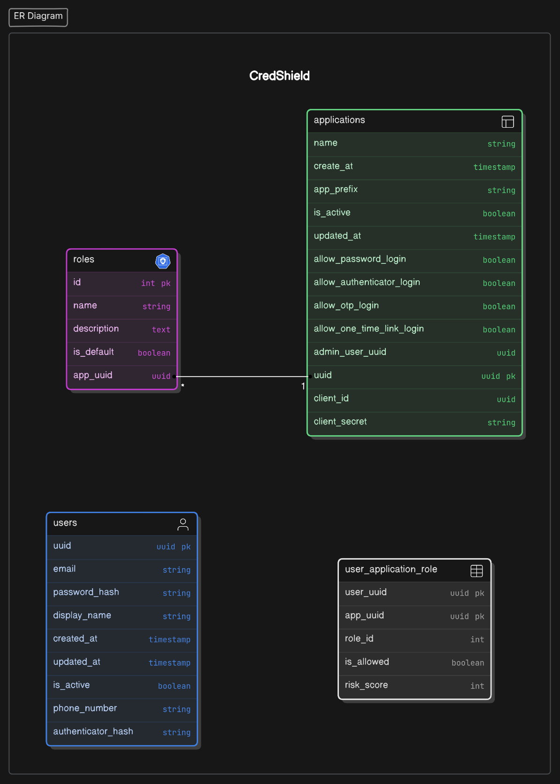

# CredShield

About:

Credshield is the the most comprehensive User Management Platform that providing various user authentication/authorization customized to each application with various access scopes.

Questions:

- Purpose of the project?
- Features/Scope of the project?
- what are the existing industry standard solutions/applications available?
- are sessions going to be maintained?
- how other modules are going to communicate with this?
- how user `information's` are going to be shared?
- how other modules can connect to our app module(i.e.,) is there any library available?
- how simplified is it to add this to their modules?
- What is the future road-map?

### Requirement Gathering / Analysis:
---

- Purpose of the project?
> **CredShield** is the the most comprehensive `User Management Platform` that providing various user authentication/authorization customized to each application with various access scopes.

- Features/Scope of the project?
    1. Session Management (User Authentication & User Authorization)
    2. User Management
    3. Customize authentication based on applications
    4. Multi-factor Authentication -  GoogleAuth, OTP, One-Time-Link Login.
    5. Seamless Integration & Good Documentation

- what are the existing industry standard solutions/applications available?
    1. Clerk - [clerk.com/](https://clerk.com/)
    2. Google Firebase - [firebase.google.com/](https://firebase.google.com/)

- are sessions going to be maintained?
> User Sessions will be maintained across sessions using session token & user essential information for the requested app will be provided via `Json Web Token(JWT)`. User Logout can be achieved from any app via the API endpoint provided by CredShield. Access Token & Refresh Token will allow other modules to access information on behalf of the authenticated application.

- how other modules are going to communicate with this?
> Communications between the other modules and our application will be done via  well defined `Rest Api's`.

- how user information's are going to be shared?
> Essential information like user email, display name, user avatar, user role for that app will be shared in the JWT Token. CredShield will also provide API's to check user session, User Analytics, user information & other required data.

- how other modules can connect to our app module(i.e.,) is there any library available?
> At the moment integration can be done via web redirection's & api's. There are future plans to build library that do all the integration with existing security framework like spring security for java.

- What is the future road-map?
    1. Mobile App development for Easier Access &  QR code scanning based access for smooth & true password-less experience like (Gpay, PhonePe).
    2. Development of libraries to easily integrate this module into their application with supporting existing frameworks like spring security for java.
    3. Additional MFA Options -  Yubikey, Social Login like Google, Microsoft, LinkedIn, GitHub, etc.,
    4. Flexibility to attach set of permissions to a role for fine grained access control to handle complex relations like allowing a role to only have read permission and not other permissions.

### Technology Stack:
---

- Java (v21)
- PostgreSQL (v15)
- Spring Boot (v3.4)
- Gradle (v8.4)

### Entities/Tables:
---

- **Users**
  | Column_Name | Datatype | Constrains | Description |
  | ----- | ----- | ----- | ----- |
  | uuid | UUID | Primary Key | Unique ID for each user |
  | email | VARCHAR(50) | NOT NULL, UNIQUE | User's email address |
  | password_hash | VARCHAR(255) | NOT NULL | Hashed password |
  | display_name | VARCHAR(50) | NOT NULL | User's name to be displayed |
  | created_at | TIMESTAMP | DEFAULT CURRENT_TIMESTAMP | Account creation date |
  | updated_at | TIMESTAMP | ON UPDATE CURRENT_TIMESTAMP | Last update date |
  | is_active | BOOLEAN | DEFAULT TRUE | User's active status |
  | phone_number | VARCHAR(20) | NOT NULL, UNIQUE | User's phone number  with country code |
  | authenticator_hash | VARCHAR(100) | NOT NULL, UNIQUE | authenticator hash to generate TOTP |
- **Applications**
  | Column_Name | Datatype | Constrains | Description |
  | ----- | ----- | ----- | ----- |
  | uuid | UUID | Primary Key, Auto Increment | Unique ID for each application |
  | name | VARCHAR(50) | NOT NULL, UNIQUE | Name of the Application |
  | created_at | TIMESTAMP | DEFAULT CURRENT_TIMESTAMP | Account creation date |
  | app_prefix | VARCHAR(5) | NOT NULL | Prefix value of an application |
  | is_active | BOOLEAN | DEFAULT TRUE | Application active status |
  | updated_at | TIMESTAMP | ON UPDATE CURRENT_TIMESTAMP | Last update date |
  | allow_password_login | BOOLEAN | DEFAULT TRUE | Indicating password login to be allowed |
  | allow_authenticator_login | BOOLEAN | DEFAULT TRUE | Indicating TOTP login to be allowed |
  | allow_otp_login | BOOLEAN | DEFAULT TRUE | Indicating OTP login to be allowed |
  | allow_one_time_link_login | BOOLEAN | DEFAULT TRUE | Indicating login via one time link to be allowed |
  | admin_user_uuid | UUID | Foreign Key (Users.uuid) | References Admin User for the Application |
  | client_id | UUID | NOT NULL, UNIQUE | Unique client identifier |
  | client_Secret | VARCHAR(255) | NOT NULL | Secret for client authentication |
- **Roles**
  | Column_Name | Datatype | Constrains | Description |
  | ----- | ----- | ----- | ----- |
  | id | INT | Primary Key, Auto Increment | Unique ID for each application role |
  | name | VARCHAR(20) | NOT NULL, UNIQUE | Name of the application role with prefix |
  | description | TEXT | NULL | Description of the role |
  | is_default | BOOLEAN | DEFAULT FALSE | Indicating whether this role is default for an app |
  | app_uuid | UUID | Foreign Key (Applications.uuid) | ID of the application which the role is linked (Many to One) |
- **User_Application_Role**
  | Column_Name | Datatype | Constrains | Description |
  | ----- | ----- | ----- | ----- |
  | user_uuid | UUID | Composite Primary Key | Reference to an User (Users.uuid) |
  | app_uuid | UUID | Composite Primary Key | Reference to an Application (Applications.uuid) |
  | role_id | INT | NOT NULL | Reference to an Role (Role.id) |
  | is_allowed | BOOLEAN | DEFAULT TRUE | Indicating whether this user is allowed for an app |
  | risk_score | INT | DEFAULT 0 | ID of the application which the role is linked (Many to One) |

### **Entity Relationship Diagram:**
---

### **High Level Design(HLD):**
---

.png)

